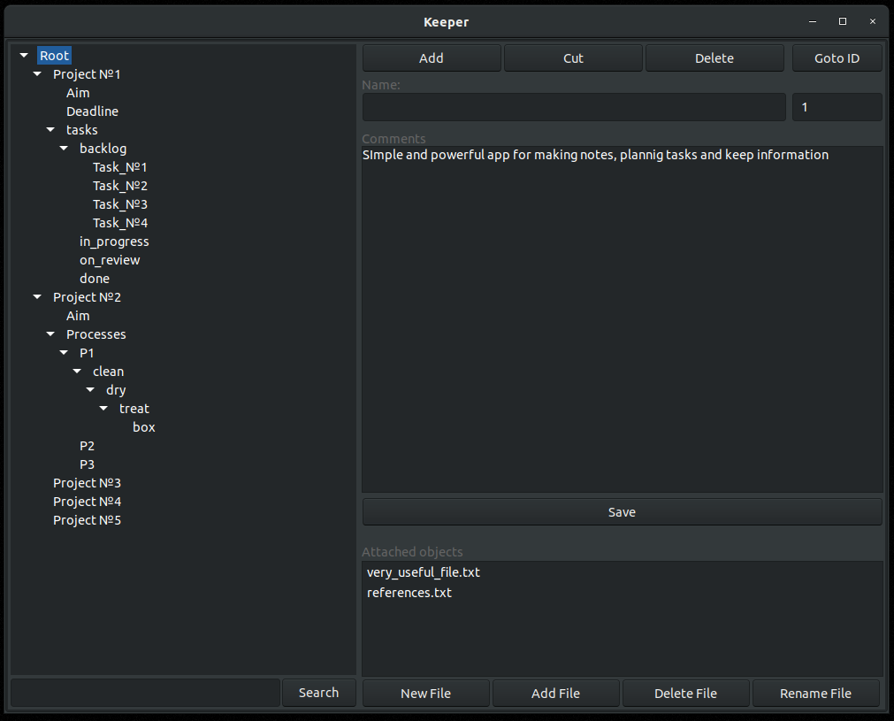
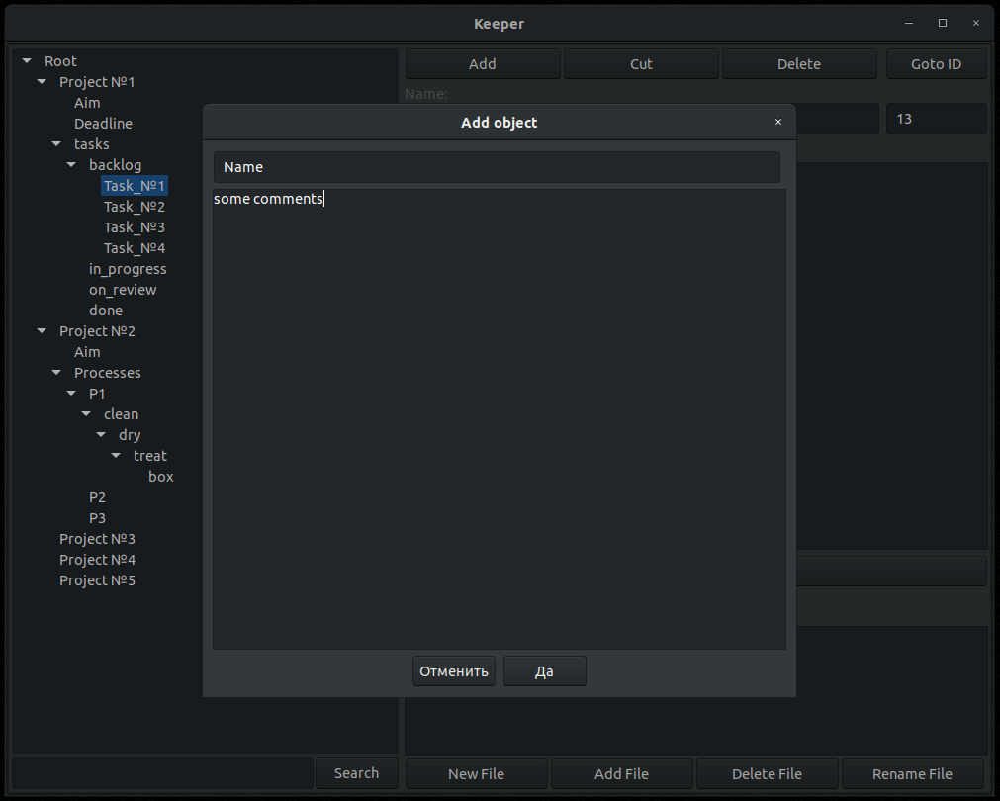

# wxKeeper

## Description
Simple but powerful application for keeping tasks, process and notes.
Hierarchical approach makes it easy to structure items. Build in search feature 
will help to find important note.

## Screenshots



## Build
The app uses wxWidgets library, so linux users have to install some packets like:
```
sudo apt install libwxbase*-dev libwxgtk*-dev
```
Cmake is used as build system
```
sudo apt install cmake
```
Next you can compile and build the app:
```
mkdir build
cd build
cmake ..
make
```
## Download binaries
Before start using the application please read term license agreement located inside zip file

[Win64 Release 1.0](https://github.com/kudryashovda/wxKepper30/raw/master/releases/1.0/keep_win64_v1.0.zip)

## License

Licensed under GPL v3 license
